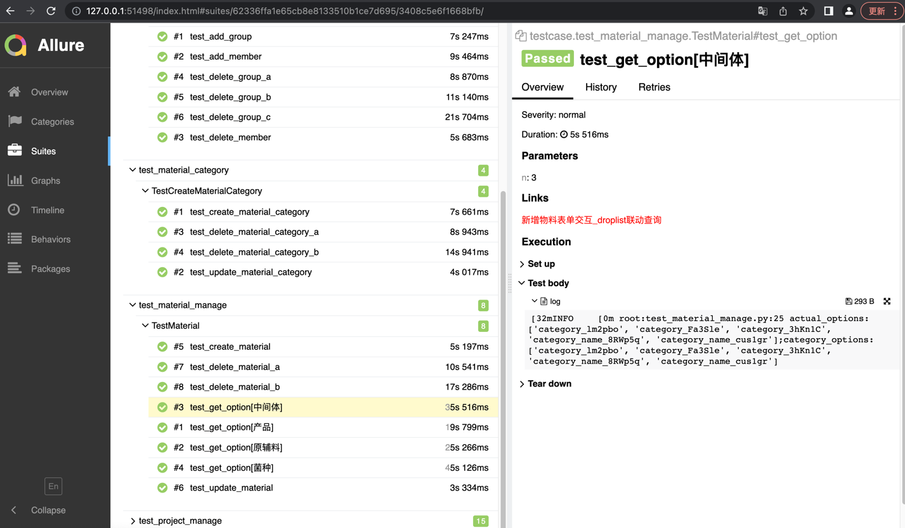

<!-- TABLE OF CONTENTS -->
<details>
  <summary>目录</summary>
  <ol>
    <li>
      <a href="#项目介绍">项目介绍</a>
      <ul>
        <li><a href="#设计模式">设计模式</a></li>
        <li><a href="#实现细节">实现细节</a></li>
      </ul>
    </li>
    <li><a href="#效果展示">效果展示</a></li>
  </ol>
</details>


<!-- HOW TO USE -->

## 如何使用

**0.安装依赖库**

```shell
pip install install -r requirements.txt
```

**1. 进入测试用例目录执行用例**

```shell
cd testcase
pytest -vs # 或使用其他需要的命令行参数
```

<!-- ABOUT THE PROJECT -->

## 项目介绍

本项目为我司工业互联网SaaS平台中plm项目（产品生命周期）的UI自动化测试项目。采用Python + pytest + Selenium 技术栈完成。

### 设计模式

采用PO设计模式。\
一些原则：
> 1.用公共方法代表UI提供的功能\
> 2.方法应该返回其他PageObject或需要用于断言的数据(实现细节中可以详细描述)\
> 3.不暴露页面内部元素给外面\

其核心思想就是封装。只暴露方法，不暴露细节。

### 实现细节

```pageObject```包内含封装的一些页面方法，关于元素定位基本采用Xpath定位方式，并灵活运用Xpath轴定位及显式等待方式令脚本整体稳定性得到较大提升。其中```base_page.py```文件内含一些页面跳转，及监听页面```dialog```数量、获取```alert```信息等公共方法。```debug.py```文件为平常本地调试页面的空间，可以较大限度地节省调试成本。\
```utils```包内含一些工具类：mock数据、读取环境数据等。\
```test_case```包内含测试用例方法，其中灵活使用```parametrize/fixture```等装饰器实现用例参数化、前后置操作及其他具体需求。\
```conftest.py```文件内含一些hook函数实现将收集的测试用例items的name和node_id的中文显示。\
另，```dev_log.md```是开发过程中记录一些思考过程和点子。

关于设计模式中的第二点原则，比如我有如下2个```python```文件：

```python
class Main:
    def click_PH_link(self):
        return PH()
```
```python
class PH:
    def get_text(self):
        pass
```
那么，PO思想的原则之一，如果页面A导航到页面B，page A应当 return page B。这样做的好处就是我可以这样写：
```python
main = Main()
main.click_ph_link().get_text()
```
例如项目中：
```python
project_name = self.group.add_group().goto_project().create_project_get_name(project_category="新品定制")
```
能够相对清晰的看出做了什么操作（添加group,跳转至project页面，创建类型为"新品定制"的project，并获得name），提高了代码可读性，易于维护。

## 效果展示

主要结合allure以测试报告网页的形式输出，这里截图如下：
